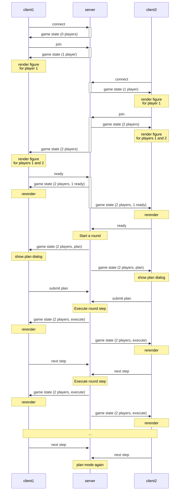

# Colt Super Express
Murder each other while on a train.

Now doesn't that sound like a fun and relaxing afternoon?

## How the code works

### Server side

The server keeps track of what is going on with a bunch of classes, such as `Game` and `Player` and `Figure` and stuff like that. There is a difference between a "Player" and a "Figure": a figure is the indicator of where the player is on the train, which might not exist. Each player has a reference to its figure, unless that player's figure has been shot off the train.

### Client side

The client repeatedly requests the game's status from the server and updates both halves of the screen accordingly. However, I wanted cool looking animations for the players. So, there are "fake" players, which are automatically (using CSS) centered inside the cars, and then there are "real" player elements, which are not removed and re-added. Instead, the position of the fake player elements are copied over to the real player elements, which is an operation that can be done with an animation.

### Phases of the game

First, everyone joins. Each player has a `ready` attribute, which is reused so many times it's ridiculous. Once everyone is ready, the game starts.

During the first phase of the game, which is called `schemin` (no G), everyone chooses 3 cards (in order) from their hand of 5 cards, and submits them.
Once everyone has submitted their plans, the server goes through the cards in order. All the clients then update the scene, and then when everyone is ready, the server will go to the next card. Once the server runs out of cards, it goes back to the first phase.